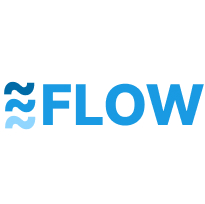
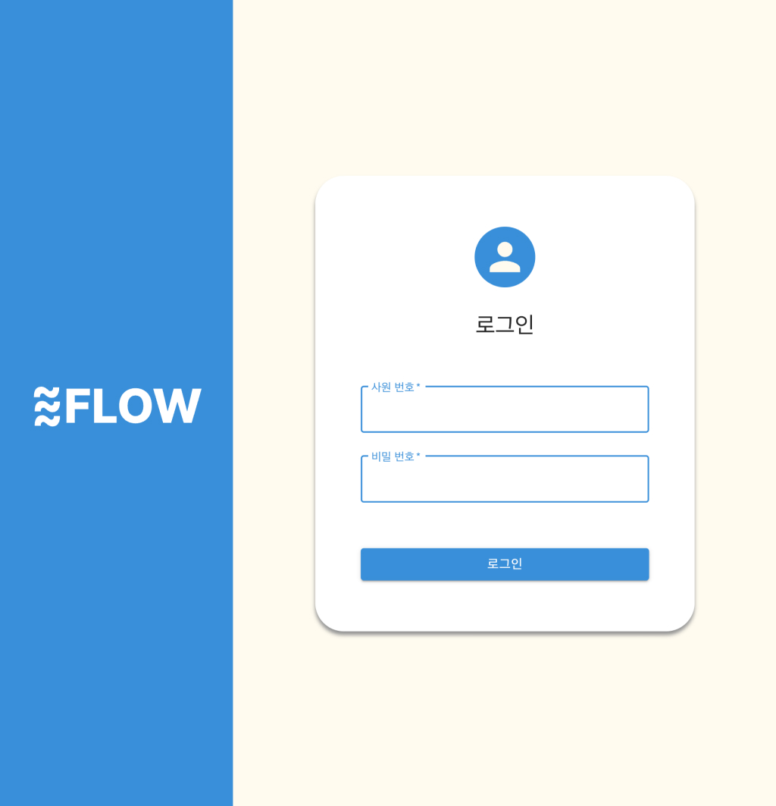
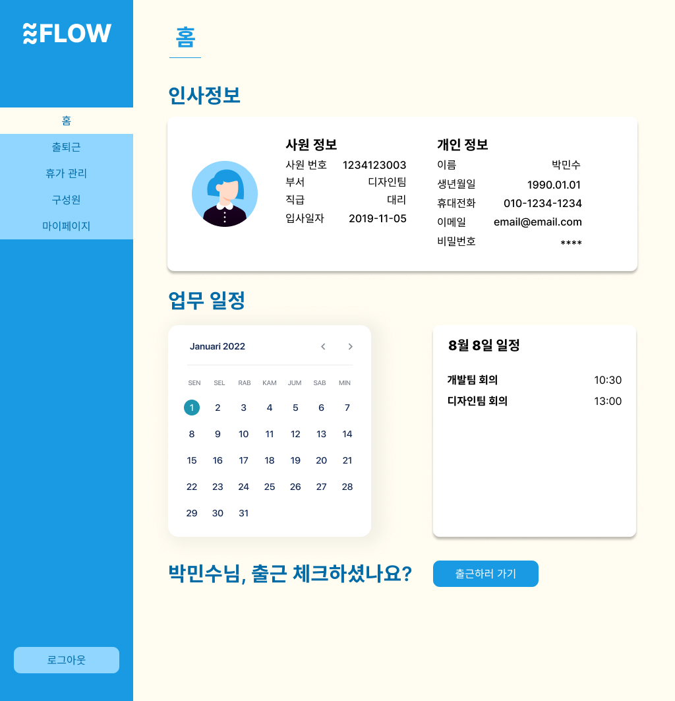
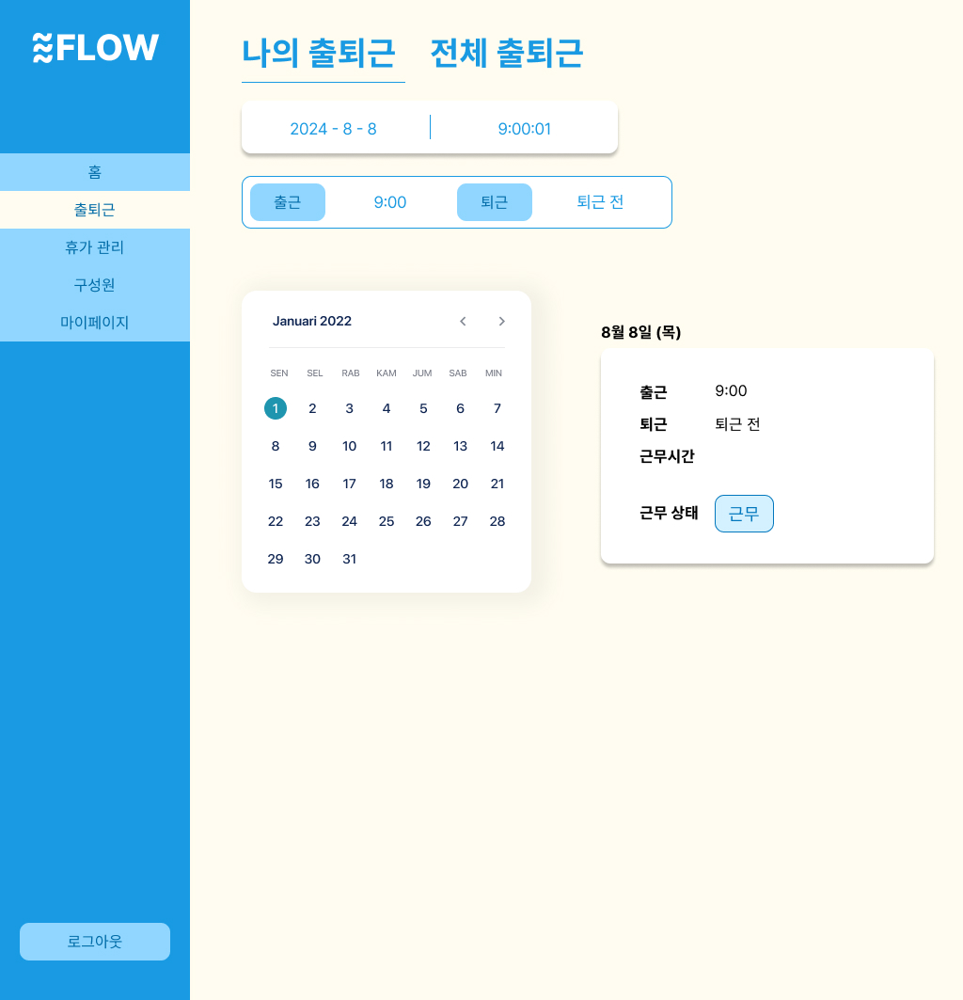
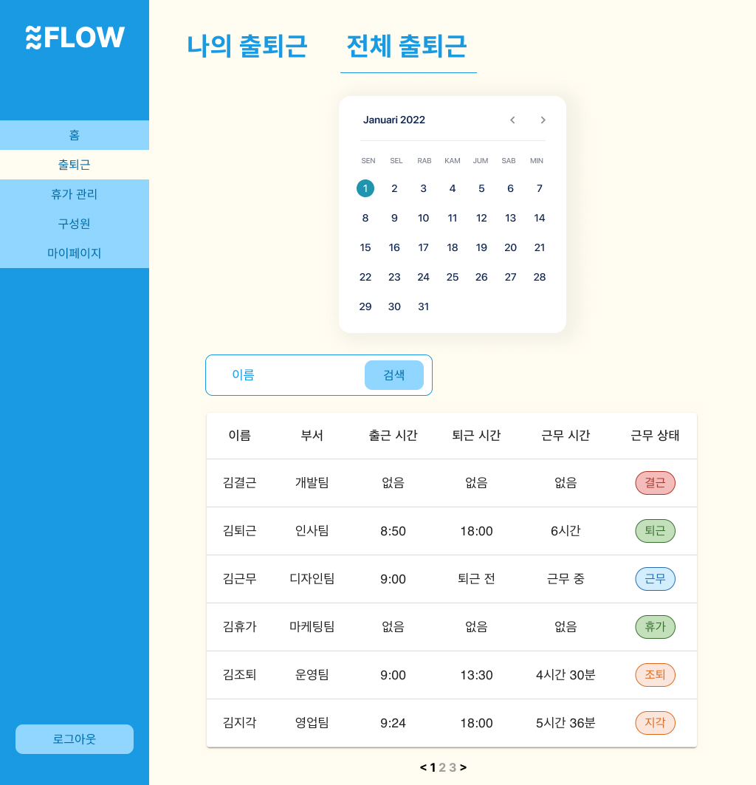
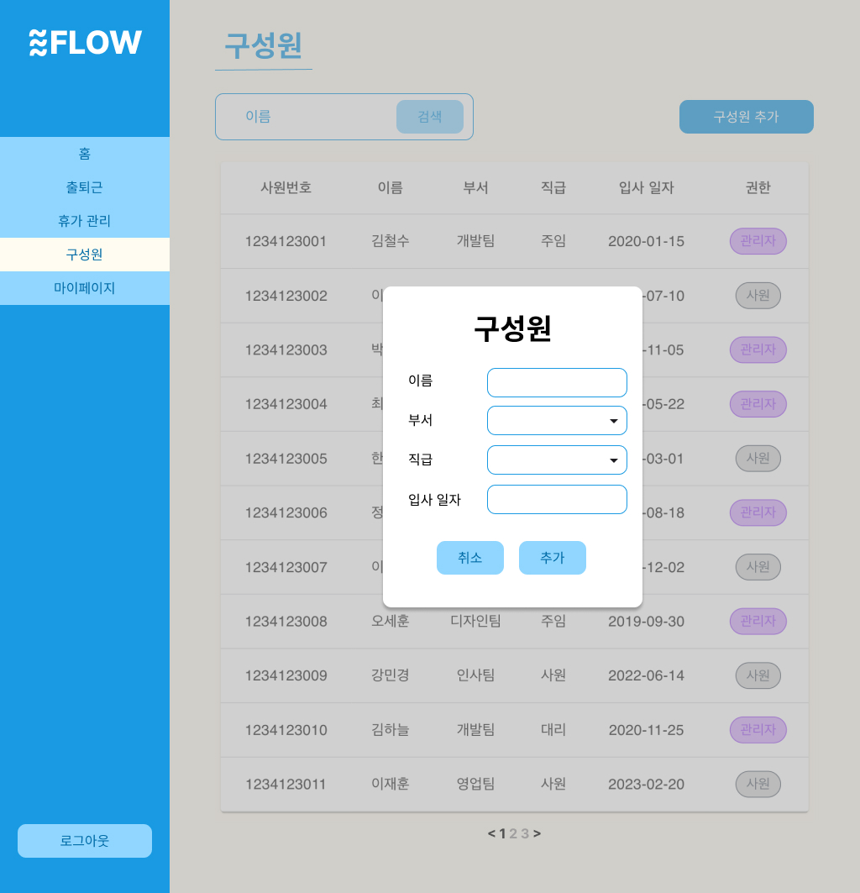
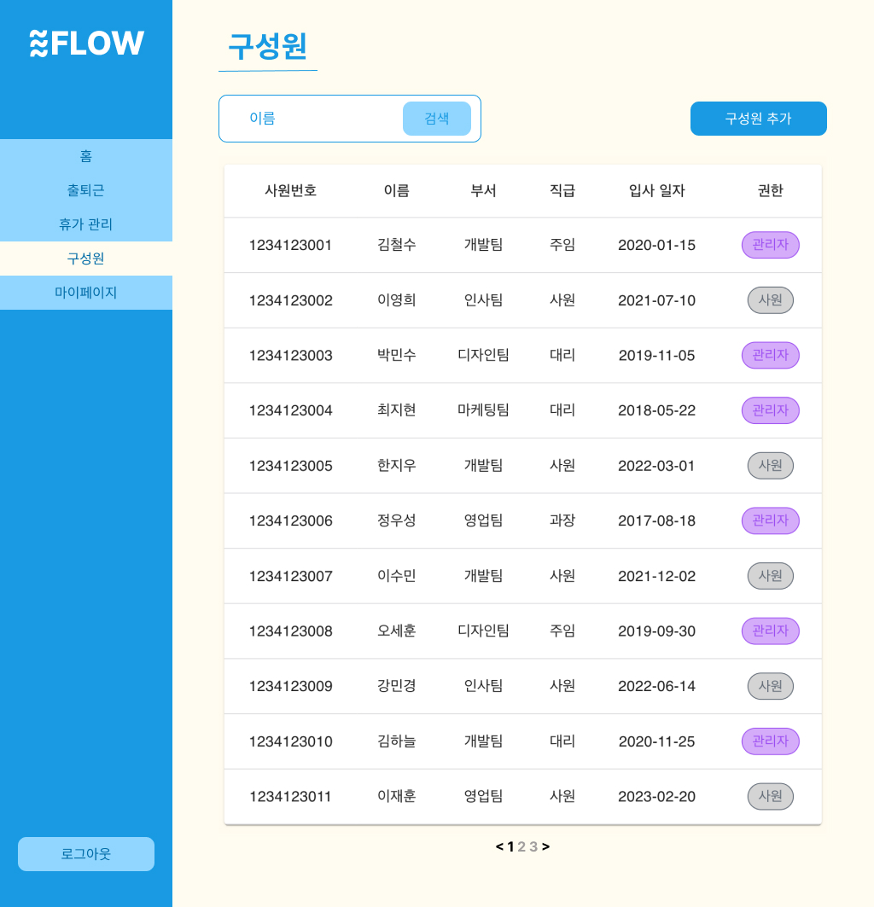

# Flow

# 소개
"Back To The Basic!"
**Flow**는 출퇴근 기록 관리, 근무 시간 관리, 휴가 및 연장 근무 관리 등을 간편하고 체계적으로 수행할 수 있는 기능을 제공합니다.  
이를 통해 기업들은 효율적인 인사 관리를 실현하고, 더 나은 업무 환경을 구축할 수 있습니다.

# 로그인 페이지

사원과 관리자가 시스템에 접근할 수 있도록 로그인 기능을 제공합니다. 인증된 사용자는 권한에 따라 접근 가능한 페이지가 다릅니다.

# 홈 페이지

인사 정보, 업무 일정, 출근 버튼 등을 한눈에 확인할 수 있는 대시보드를 제공합니다. 빠르고 직관적인 정보 확인이 가능합니다.

# 출퇴근 페이지

모든 사용자는 출퇴근 체크를 통해 자신의 출퇴근 시간을 기록할 수 있습니다. 

관리자는 모든 사원의 출퇴근 기록을 조회할 수 있으며, 각 사원도 자신의 기록을 손쉽게 확인할 수 있습니다.

# 구성원 페이지

관리자는 새로운 사원을 시스템에 등록하고, 등록된 사원만이 시스템을 이용할 수 있도록 제한합니다. 

구성원 관리 기능을 통해 조직의 인사 관리를 효율적으로 수행할 수 있습니다.

# 기술스택
- Java17
- SpringBoot
- PostgreSQL
